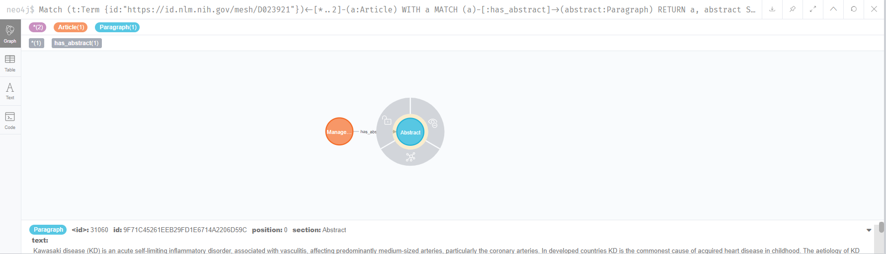

# COVID19 Knowledge graph

This project takes the dataset from [CORD19](https://github.com/SciBiteLabs/CORD19) project ([website](https://pages.semanticscholar.org/coronavirus-research)).

Our work is part of the [Knowledge Graph](https://github.com/virtual-biohackathons/covid-19-bh20/wiki/KnowledgeGraph) task for the virtual [COVID-19 Biohackathon](https://github.com/virtual-biohackathons/covid-19-bh20).

# TOC

* [Mapping the JSON schema into LPG](#mapping-the-json-schema-into-lpg)
* [Node properties](#node-properties)
* [Edges properties](#edges-properties)
* [Cypher queries](#cypher-queries)

# Mapping the JSON schema into LPG

The dataset JSON schema is the [following](https://ai2-semanticscholar-cord-19.s3-us-west-2.amazonaws.com/2020-03-13/json_schema.txt).
Our current model is:


# Node properties

Each node has the following properties and labels ([node_properties.csv](model/node_properties.csv)):

|nodeType    |nodeLabels |propertyName|propertyTypes|mandatory|
|------------|-----------|------------|-------------|---------|
|:`Author`   |[Author]   |middle      |[StringArray]|true     |
|:`Author`   |[Author]   |last        |[String]     |true     |
|:`Author`   |[Author]   |suffix      |[String]     |true     |
|:`Author`   |[Author]   |first       |[String]     |true     |
|:`Author`   |[Author]   |email       |[String]     |false    |
|:`Term`     |[Term]     |id          |[String]     |true     |
|:`Term`     |[Term]     |name        |[String]     |true     |
|:`Ontology` |[Ontology] |name        |[String]     |true     |
|:`Paragraph`|[Paragraph]|id          |[String]     |true     |
|:`Paragraph`|[Paragraph]|position    |[Long]       |true     |
|:`Paragraph`|[Paragraph]|text        |[String]     |true     |
|:`Paragraph`|[Paragraph]|section     |[String]     |true     |
|:`CiteSpan` |[CiteSpan] |text        |[String]     |true     |
|:`CiteSpan` |[CiteSpan] |start       |[Long]       |true     |
|:`CiteSpan` |[CiteSpan] |end         |[Long]       |true     |
|:`CiteSpan` |[CiteSpan] |ref_id      |[String]     |false    |
|:`RefSpan`  |[RefSpan]  |text        |[String]     |true     |
|:`RefSpan`  |[RefSpan]  |start       |[Long]       |true     |
|:`RefSpan`  |[RefSpan]  |end         |[Long]       |true     |
|:`RefSpan`  |[RefSpan]  |ref_id      |[String]     |false    |
|:`BibEntry` |[BibEntry] |id          |[String]     |true     |
|:`BibEntry` |[BibEntry] |title       |[String]     |true     |
|:`BibEntry` |[BibEntry] |volume      |[String]     |true     |
|:`BibEntry` |[BibEntry] |venue       |[String]     |true     |
|:`BibEntry` |[BibEntry] |pages       |[String]     |true     |
|:`BibEntry` |[BibEntry] |issn        |[String]     |true     |
|:`BibEntry` |[BibEntry] |year        |[Long]       |false    |
|:`RefEntry` |[RefEntry] |id          |[String]     |true     |
|:`RefEntry` |[RefEntry] |text        |[String]     |true     |
|:`RefEntry` |[RefEntry] |type        |[String]     |true     |
|:`DOI`      |[DOI]      |id          |[String]     |true     |
|:`Article`  |[Article]  |id          |[String]     |true     |
|:`Article`  |[Article]  |title       |[String]     |true     |
|:`Article`  |[Article]  |license     |[String]     |true     |

# Edges properties

Each edge has the following properties ([edges_properties.csv](model/edges_properties.csv)):

|relType                    |propertyName      |propertyTypes|mandatory|
|---------------------------|------------------|-------------|---------|
|:`has_author`              |null              |null         |false    |
|:`has_metadata_annotations`|hit_sentence_start|[Long]       |true     |
|:`has_metadata_annotations`|hit_sentence_end  |[Long]       |true     |
|:`has_metadata_annotations`|hit_sentences     |[Long]       |true     |
|:`from_ontology`           |null              |null         |false    |
|:`has_annotations`         |hit_sentence_start|[Long]       |true     |
|:`has_annotations`         |hit_sentence_end  |[Long]       |true     |
|:`has_annotations`         |hit_sentences     |[Long]       |true     |
|:`has_abstract`            |null              |null         |false    |
|:`has_bodytext`            |null              |null         |false    |
|:`contains_citespan`       |null              |null         |false    |
|:`contains_refspan`        |null              |null         |false    |
|:`has_bibentry`            |null              |null         |false    |
|:`has_refentry`            |null              |null         |false    |
|:`has_back_matter`         |null              |null         |false    |
|:`has_reference`           |null              |null         |false    |

# Cypher queries

Retrieve relevant terms for a specific input, e.g. as typeahead.

```cypher
CALL db.index.fulltext.queryNodes('termIndex', '<Input>~')
YIELD node, score
RETURN node ORDER BY score DESC SKIP <PAGE> LIMIT <PAGE_SIZE>;
```


Fetch articles and their abstracts annotated with a specific term.
```cypher
Match (t:Term {id:"<TermID>"})<-[*..2]-(a:Article)
WITH a
MATCH (a)-[:has_abstract]->(abstract:Paragraph)
RETURN a, abstract SKIP <PAGE> LIMIT <PAGE_SIZE>;
```



Retrieve all terms appearing in an article.

```cypher
Match (t:Term)<-[r:has_annotations]-(p:Paragraph)<-[*..2]-(a:Article {id:"<ArticleID>"})
RETURN t  SKIP <PAGE> LIMIT <PAGE_SIZE>;
```


Retrieve the context of the annotation.
```cypher
Match (t:Term {id:"<TermID>"})<-[r:has_annotations]-(p:Paragraph)<-[*..2]-(a:Article {id:"<ArticleID>"})
RETURN t, p, COLLECT(r) as spans ORDER BY p.position ASC SKIP <PAGE> LIMIT <PAGE_SIZE>;
```


Retrieve the article title, authors, abstract, bodytext, backmatter and bibliography.

```cypher
MATCH (article:Article {id:"<ArticleID>"})
WITH article
MATCH (author:Author)<-[:has_author]-(article)
WITH article, COLLECT(author) as authors
MATCH (abstract:Paragraph)<-[:has_abstract]-(article)
WITH article, authors, COLLECT(abstract) as abstracts
MATCH (bodytext:Paragraph)<-[:has_bodytext]-(article)
WITH article, authors, abstracts, bodytext
ORDER BY bodytext.position ASC
WITH article, authors, abstracts, COLLECT(bodytext) as bodytexts
MATCH (backmatter:Paragraph)<-[:has_back_matter]-(article)
WITH article, authors, abstracts, bodytexts, COLLECT(backmatter) as backmatters
MATCH (bibEntry:BibEntry)<-[:has_bibentry]-(article)
RETURN article, authors, abstracts, bodytexts, backmatters, COLLECT(bibEntry) as bibEntries
```

